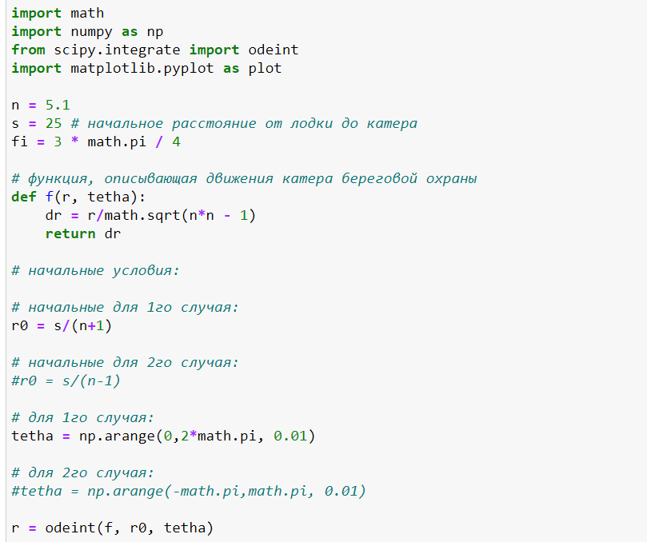
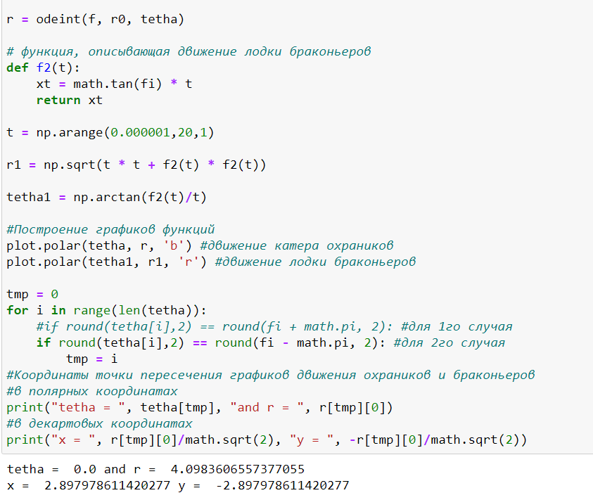
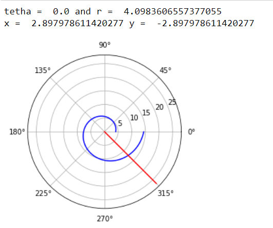
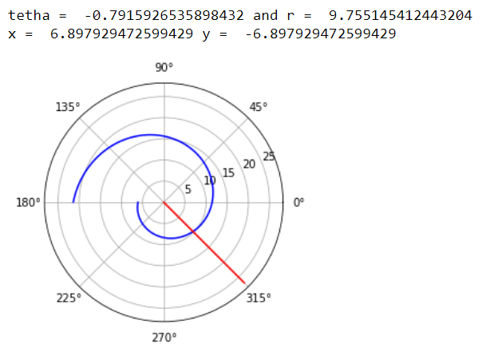
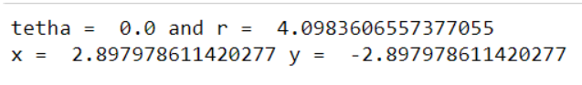
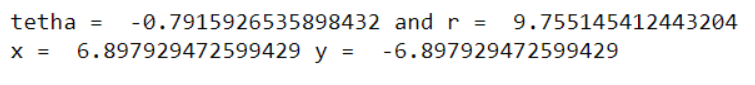

---
# Front matter
lang: ru-RU
title: "Лабораторная работа №2"
subtitle: "Задача о погоне"
author: "Карымшаков Артур Алишерович"

# Formatting
toc-title: "Содержание"
toc: true # Table of contents
toc_depth: 2
lof: true # List of figures
lot: true # List of tables
fontsize: 12pt
linestretch: 1.5
papersize: a4paper
documentclass: scrreprt
polyglossia-lang: russian
polyglossia-otherlangs: english
mainfont: PT Serif
romanfont: PT Serif
sansfont: PT Sans
monofont: PT Mono
mainfontoptions: Ligatures=TeX
romanfontoptions: Ligatures=TeX
sansfontoptions: Ligatures=TeX,Scale=MatchLowercase
monofontoptions: Scale=MatchLowercase
indent: true
pdf-engine: lualatex
header-includes:
  - \linepenalty=10 # the penalty added to the badness of each line within a paragraph (no associated penalty node) Increasing the value makes tex try to have fewer lines in the paragraph.
  - \interlinepenalty=0 # value of the penalty (node) added after each line of a paragraph.
  - \hyphenpenalty=50 # the penalty for line breaking at an automatically inserted hyphen
  - \exhyphenpenalty=50 # the penalty for line breaking at an explicit hyphen
  - \binoppenalty=700 # the penalty for breaking a line at a binary operator
  - \relpenalty=500 # the penalty for breaking a line at a relation
  - \clubpenalty=150 # extra penalty for breaking after first line of a paragraph
  - \widowpenalty=150 # extra penalty for breaking before last line of a paragraph
  - \displaywidowpenalty=50 # extra penalty for breaking before last line before a display math
  - \brokenpenalty=100 # extra penalty for page breaking after a hyphenated line
  - \predisplaypenalty=10000 # penalty for breaking before a display
  - \postdisplaypenalty=0 # penalty for breaking after a display
  - \floatingpenalty = 20000 # penalty for splitting an insertion (can only be split footnote in standard LaTeX)
  - \raggedbottom # or \flushbottom
  - \usepackage{float} # keep figures where there are in the text
  - \floatplacement{figure}{H} # keep figures where there are in the text
---

# Цель работы

Построение математической модели для выбора правильной стратегии при решении задачи о погоне.

# Задание

1. Записать уравнение, описывающее движение катера, с начальными условиями для двух случаев (в зависимости от расположения катера относительно лодки в начальный момент времени).
2. Построить траекторию движения катера и лодки для двух случаев.
3. Найдти точку пересечения траектории катера и лодки

# Выполнение лабораторной работы

1. Известны начальные данные задачи: лодка обнаруживается на расстоянии s = 25 км от катера, и скорость катера в 5.1 раза больше чем скорость лодки.
Для того, чтобы описать уравнение движения катера необходимо, во-первых, выразить
$$x_1 = \frac{s}{n + 1}, $$ где \(x~1~ - начальное расстояние между лодкой и катером для 1го случая\)
$$x_2 = \frac{s}{n - 1}, $$ где \(x~2~ - начальное расстояние между лодкой и катером для 2го случая\)
Во-вторых, нужно выразить дифференциальное уравнение в общем виде
$$x_1 = \frac{dr}{d\theta}=\frac{r}{\sqrt{n^2-1}} $$
Ниже представлен код программы, в котором присутствуют два вышеописанных уравнения. Часть 1: (рис 1. -@fig:001)

{ #fig:001 width=70% } 

Ниже представлен код программы, в котором присутствуют два вышеописанных уравнения. Часть 2: (рис 2. -@fig:001)

{ #fig:001 width=70% }
 
2. Добавлю в код программы функцию, позволяющую строить в полярных координатах траектории движений катера и лодки для 1го случая. Результат следующий: (рис 3. -@fig:001)  

{ #fig:001 width=70% }  

3. Теперь произведу изменения так, чтобы функция смогла построить в полярных координатах траектории движений катера и лодки для 2го случая (рис 4. -@fig:001)  

{ #fig:001 width=70% }  

4. Найду точку пересечения траекторий катера и лодки для 1го случая. Точка пересечения данных графиков - точка, в которой радиусы и углы обоих функций совпадают (в полярных координатах).  
Добавлю фрагмент к коду программе, позволяющий найти эту точку и выведу координаты этой точки в полярных и декартовых координатах. Результат следующий: (рис 5. -@fig:001)  

{ #fig:001 width=70% }  

5. Теперь найду координаты 2ой точки пересечения в декартовых и полярных координатах. Результат следующий: (рис 6. -@fig:001)  

{ #fig:001 width=70% }

# Выводы

Научился строить модель для выбора правильной стратегии при решение задачи о погоне.
