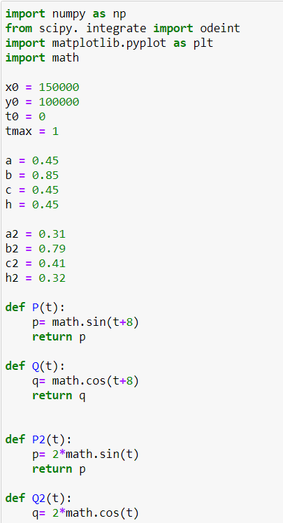
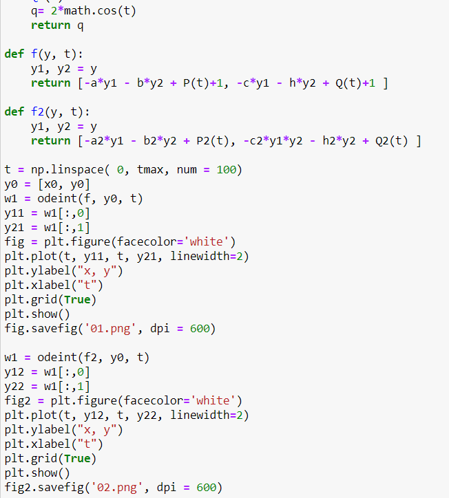
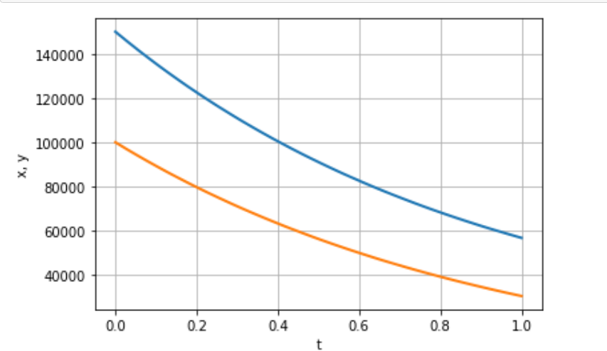
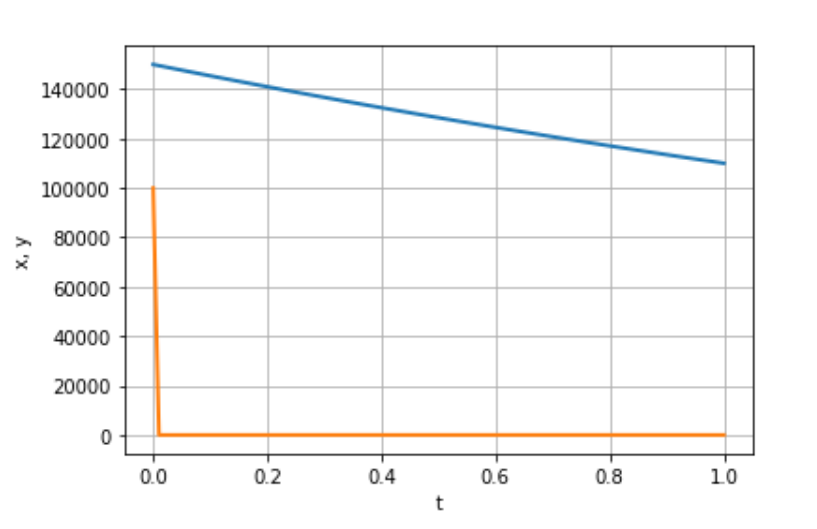

---
# Front matter
lang: ru-RU
title: "Лабораторная работа №3"
subtitle: "Модель боевых действий"
author: "Карымшаков Артур Алишерович"

# Formatting
toc-title: "Содержание"
toc: true # Table of contents
toc_depth: 2
lof: true # List of figures
lot: true # List of tables
fontsize: 12pt
linestretch: 1.5
papersize: a4paper
documentclass: scrreprt
polyglossia-lang: russian
polyglossia-otherlangs: english
mainfont: PT Serif
romanfont: PT Serif
sansfont: PT Sans
monofont: PT Mono
mainfontoptions: Ligatures=TeX
romanfontoptions: Ligatures=TeX
sansfontoptions: Ligatures=TeX,Scale=MatchLowercase
monofontoptions: Scale=MatchLowercase
indent: true
pdf-engine: lualatex
header-includes:
  - \linepenalty=10 # the penalty added to the badness of each line within a paragraph (no associated penalty node) Increasing the value makes tex try to have fewer lines in the paragraph.
  - \interlinepenalty=0 # value of the penalty (node) added after each line of a paragraph.
  - \hyphenpenalty=50 # the penalty for line breaking at an automatically inserted hyphen
  - \exhyphenpenalty=50 # the penalty for line breaking at an explicit hyphen
  - \binoppenalty=700 # the penalty for breaking a line at a binary operator
  - \relpenalty=500 # the penalty for breaking a line at a relation
  - \clubpenalty=150 # extra penalty for breaking after first line of a paragraph
  - \widowpenalty=150 # extra penalty for breaking before last line of a paragraph
  - \displaywidowpenalty=50 # extra penalty for breaking before last line before a display math
  - \brokenpenalty=100 # extra penalty for page breaking after a hyphenated line
  - \predisplaypenalty=10000 # penalty for breaking before a display
  - \postdisplaypenalty=0 # penalty for breaking after a display
  - \floatingpenalty = 20000 # penalty for splitting an insertion (can only be split footnote in standard LaTeX)
  - \raggedbottom # or \flushbottom
  - \usepackage{float} # keep figures where there are in the text
  - \floatplacement{figure}{H} # keep figures where there are in the text
---

# Цель работы

Ознакомление с одной из простейших моделей боевых действий – моделью Ланчестера.

# Задание

1. Построить график изменения численности войск армии Х и армии У для случая боевых действий между регулярными войсками.
2. Построить график изменения численности войск армии Х и армии У для ведения боевых действий с участием регулярных войск и партизанских отрядов.

# Выполнение лабораторной работы

Начальные данные задачи: начальная численность войска X = 150000 человек, а численность войска Y = 100000 человек.  
Коэффициенты влияния различных факторов для войск X и Y в первом случае:
a = 0.45 и h = 0.45, во втором случае:
a = 0.31 и h = 0.32.  
Коэффициенты эффективности боевых действий для войск X и Y в первом случае: 
b = 0.85 и c = 0.45, во втором случае:
b = 0.79 и c = 0.41.  
Функции подкрепления к войскам X и Y в первом случае: 
p(t) = sin(t+8) + 1 и q(t) = cos(t+8) + 1, во втором случае:
p(t) = 2sin(t) и q(t) = 2cos(t).  

Ниже представлен код программы, выполненной на языке программирования Python (часть первая): (рис 1. -@fig:001)  

{ #fig:001 width=70% }  

Ниже представлен код программы, выполненной на языке программирования Python (часть вторая): (рис 2. -@fig:001)  

{ #fig:001 width=70% } 

1. Рассмотрим модель боевых действий для двух регулярных армий:
$$\frac{dx}{dt}=-0,45x(t)-0,85y(t)+sin(t+8)+1 $$
$$\frac{dy}{dt}=-0,45x(t)-0,45y(t)+cos(t+8)+1 $$

Ниже представлен график для первого случая. (рис 3. -@fig:001)  

{ #fig:001 width=70% }    

2. Рассмотрим модель ведения боевых действий с участием регулярной и партизанской армий:
$$\frac{dx}{dt}=-0,31x(t)-0,79y(t)+2sin(t) $$
$$\frac{dy}{dt}=-0,41x(t)-0,32y(t)+2cos(t) $$

Ниже представлен график для второго случая. (рис 4. -@fig:001)  

{ #fig:001 width=70% }  

# Выводы

Научился строить модель Ланчестера для ведения боевых действий.
