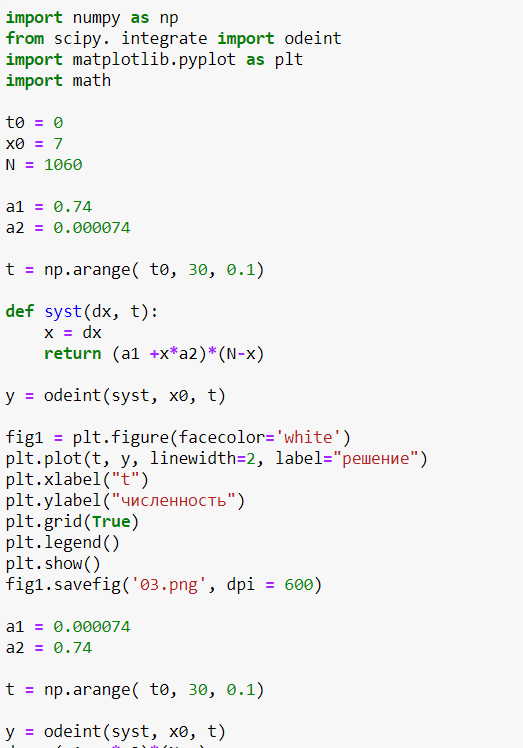
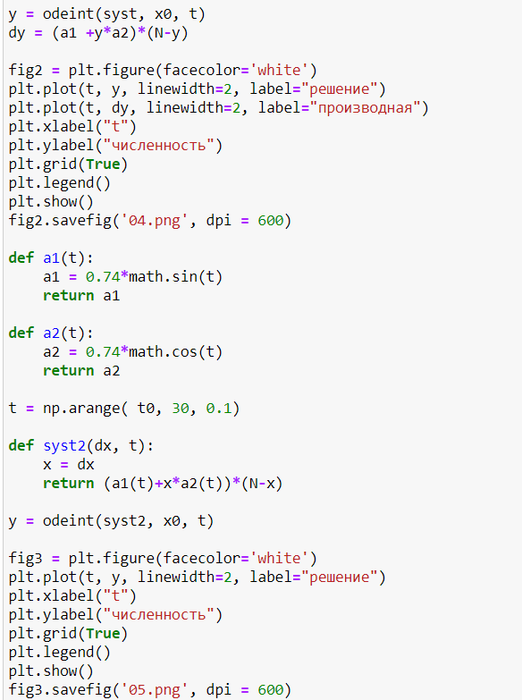
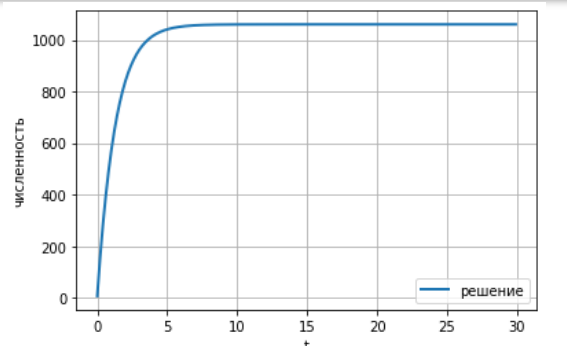
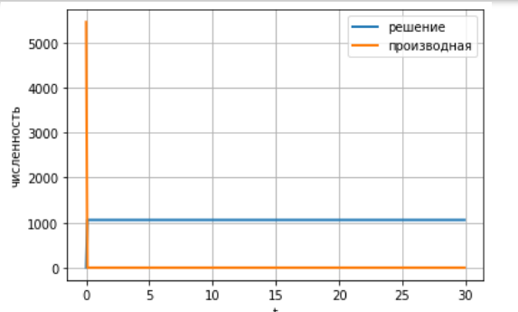
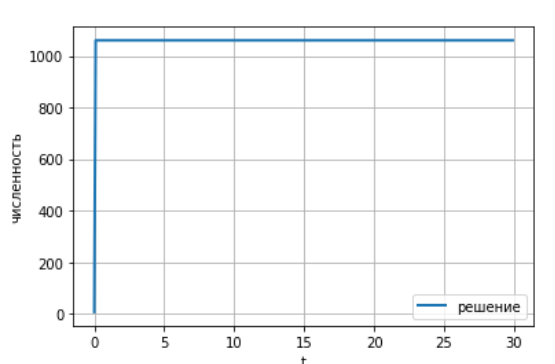

---
# Front matter
lang: ru-RU
title: "Лабораторная работа №7"
subtitle: "Модель эффективности рекламы"
author: "Карымшаков Артур Алишерович"

# Formatting
toc-title: "Содержание"
toc: true # Table of contents
toc_depth: 2
lof: true # List of figures
lot: true # List of tables
fontsize: 12pt
linestretch: 1.5
papersize: a4paper
documentclass: scrreprt
polyglossia-lang: russian
polyglossia-otherlangs: english
mainfont: PT Serif
romanfont: PT Serif
sansfont: PT Sans
monofont: PT Mono
mainfontoptions: Ligatures=TeX
romanfontoptions: Ligatures=TeX
sansfontoptions: Ligatures=TeX,Scale=MatchLowercase
monofontoptions: Scale=MatchLowercase
indent: true
pdf-engine: lualatex
header-includes:
  - \linepenalty=10 # the penalty added to the badness of each line within a paragraph (no associated penalty node) Increasing the value makes tex try to have fewer lines in the paragraph.
  - \interlinepenalty=0 # value of the penalty (node) added after each line of a paragraph.
  - \hyphenpenalty=50 # the penalty for line breaking at an automatically inserted hyphen
  - \exhyphenpenalty=50 # the penalty for line breaking at an explicit hyphen
  - \binoppenalty=700 # the penalty for breaking a line at a binary operator
  - \relpenalty=500 # the penalty for breaking a line at a relation
  - \clubpenalty=150 # extra penalty for breaking after first line of a paragraph
  - \widowpenalty=150 # extra penalty for breaking before last line of a paragraph
  - \displaywidowpenalty=50 # extra penalty for breaking before last line before a display math
  - \brokenpenalty=100 # extra penalty for page breaking after a hyphenated line
  - \predisplaypenalty=10000 # penalty for breaking before a display
  - \postdisplaypenalty=0 # penalty for breaking after a display
  - \floatingpenalty = 20000 # penalty for splitting an insertion (can only be split footnote in standard LaTeX)
  - \raggedbottom # or \flushbottom
  - \usepackage{float} # keep figures where there are in the text
  - \floatplacement{figure}{H} # keep figures where there are in the text
---

# Цель работы

Ознакомление с моделью Мальтуса и моделью логистической кривой на примере рекламной компании. 

# Задание

1. Построить график распространения рекламы, математическая модель которой описывается следующим уравнением: $\frac{dn}{dt} = (0.74+0.000074n(t))(N-n(t))$
2. Построить график распространения рекламы, математическая модель которой описывается следующим уравнением: $\frac{dn}{dt} = (0.000074+0.74n(t))(N-n(t))$  
Для этого случая определить, в какой момент времени скорость распространения рекламы будет иметь максимальное значение.
3. Построить график распространения рекламы, математическая модель которой описывается следующим уравнением: $\frac{dn}{dt} = (0.74sin(t)+0.74cos(t)n(t)(N-n(t))$

# Выполнение лабораторной работы

После запуска рекламных объявлений скорость изменения числа знающих о продукции людей пропорциональна как числу знающих о товаре покупателей, так и числу покупателей о нем не знающих.  
При этом объем аудитории $N = 1060$, в начальный момент о товаре знает 7 человек. 

Ниже приведен код для решения задачи (часть 1): (рис -@fig:001)  

{ #fig:001 width=70% }

Ниже приведен код для решения задачи (часть 2): (рис -@fig:002)  

{ #fig:002 width=70% }

1. График распространения рекламы для первого уравнения: (рис -@fig:003)  

{ #fig:003 width=70% }

2. График распространения рекламы для второго уравнения: (рис -@fig:004)  

{ #fig:004 width=70% }

Максимальная скорость распространения достигается при $t=0$

3. График распространения рекламы для третьего уравнения: (рис -@fig:005)   

{ #fig:005 width=70% }
 

# Выводы

Ознакомился с моделью Мальтуса и моделью логистической кривой на примере эффективности рекламы, построил соответствующие графики. 
